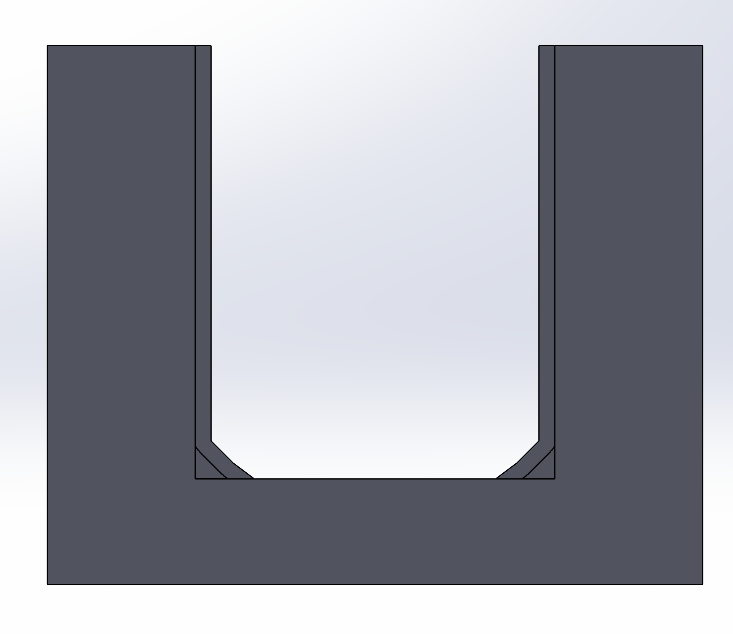
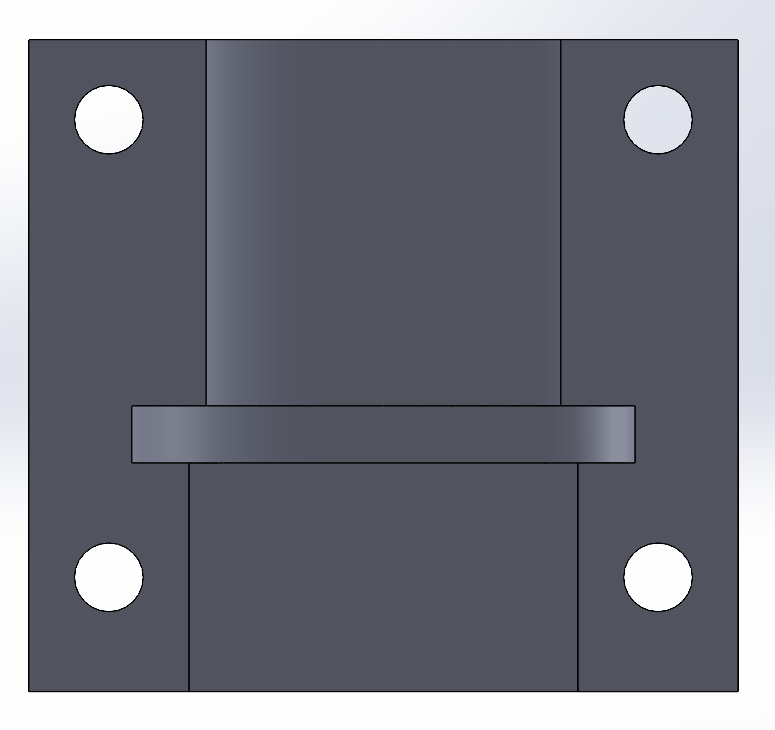
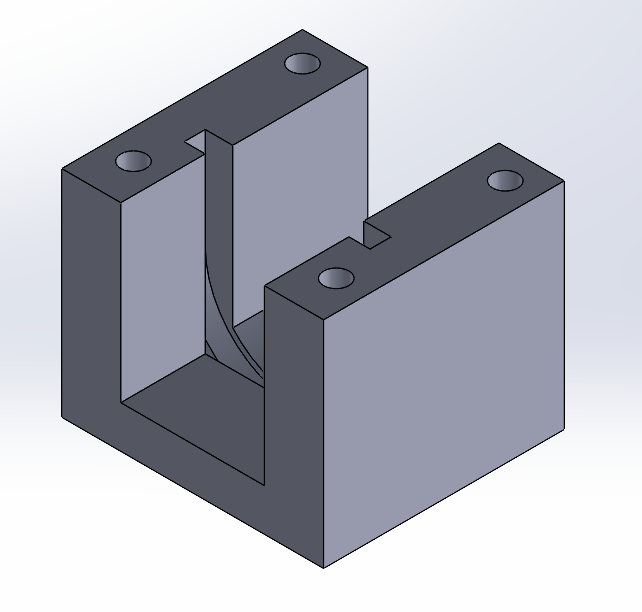

# Drivetrain

Any and all parts related to the 2nd Bot drivetrain.

## Parts locations

The wheels are located to either side of the robot.

The motor brackets are connected to the base plate of the bot

## settings used for printing

- 30% infil
- default profile (0.2mm)

## Images

Current components:

