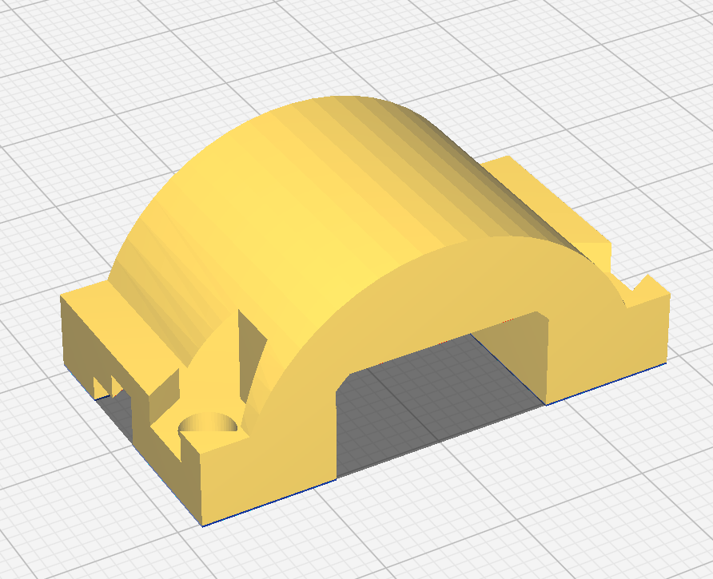
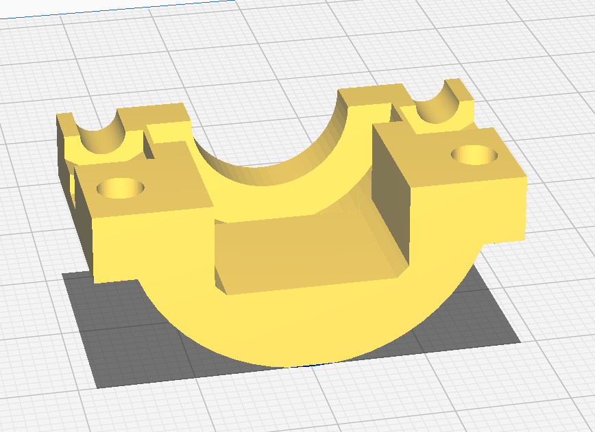
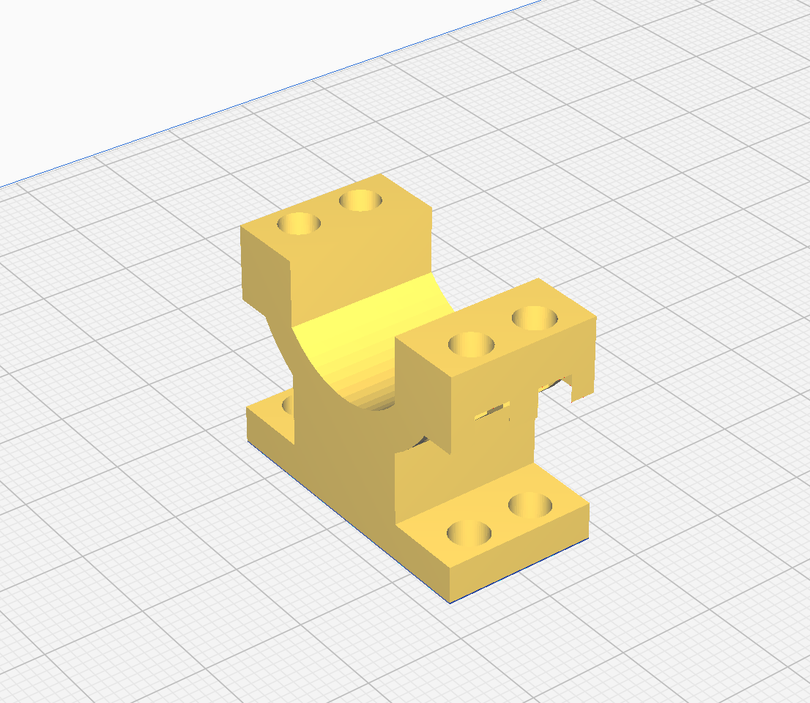

# Drivetrain

Any and all parts related to the Dave drivetrain.

## Parts locations
The wheels are located to either side of the robot. 

The motor brackets are located inside the robot housing adjacent to the wheels to hold the motors up. Version two has the mounts attach to the walls of the robot, whereas version one has a single pillar mounting to the floor of the robot

## settings used for printing 
 - 30% infil
 - default profile (0.2mm)

## Images

Current components:

Outdated/used prior:

