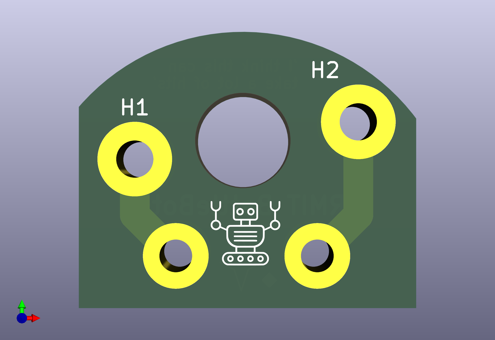
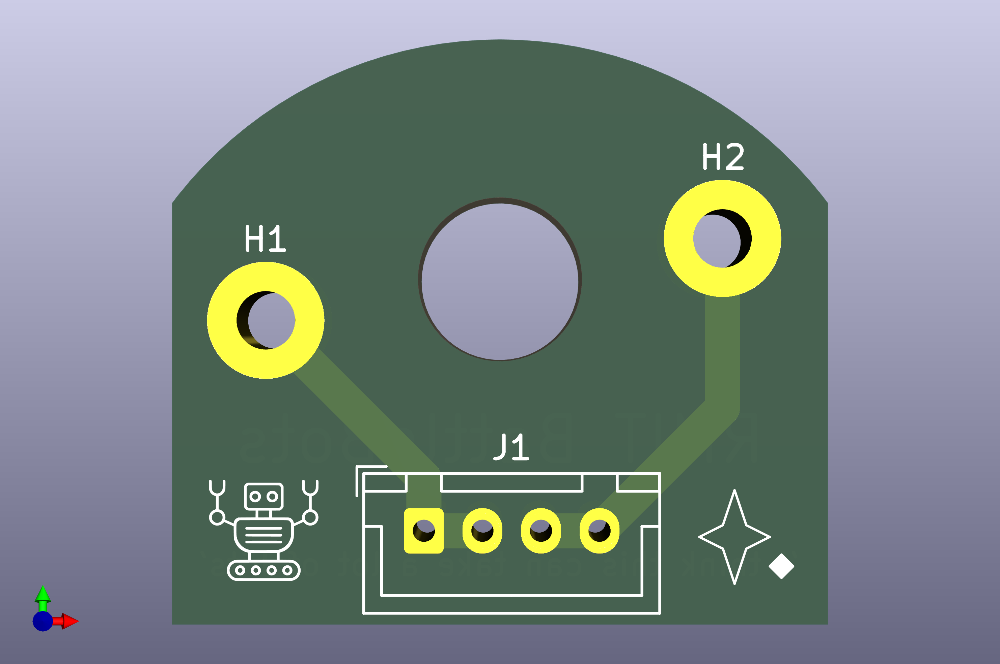

# Electronics

Folder contains electronics parts for Dave.

## Part(s) locations
The motor PCBs are located on the motors, where the motor pins are slotted and soldered into the two larger offset pin through holes in the PCB. 

## Version 2 Notes
 - Motor PCB is to allow for strong and compact perpindicular electrical connections within the robot housing.
     - Track width is 2.0mm which is more than enough for a 1-  2Amps
 - Overall profile is smaller, with larger holes
 - Made in KiCad

## Version 1 Notes 
 - Motor PCB is to allow for strong and compact perpindicular electrical connections within the robot housing.
     - Track width is like 2 or 1.5mm which is more than enough for a 1-2Amps
     - The lower 4 through holes which are compatible with JST XH A connectors (standard 2.5mm spacing) 
 - Made in KiCad

## Images

Current components:

#### Version 2

#### Version 1

