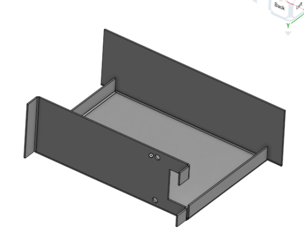
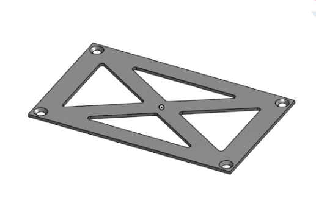
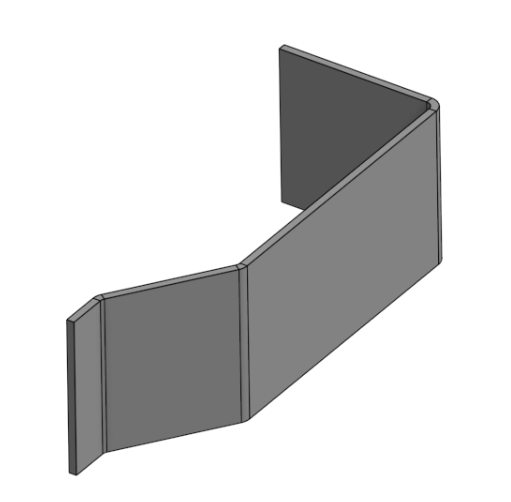

# Housing

Any and all parts related to the Dave housing/armour.

## Parts locations

The bracket is located in 4 instances, and uses bolts to fasten the side walls, roof and floor of the robot at each corner.

## settings used for printing

(?)

## Images

# V2 Housing

## Images

