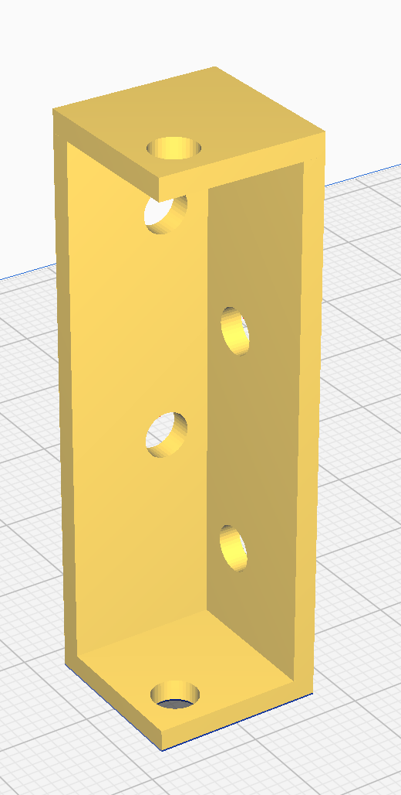

# Housing

Any and all parts related to the Dave housing/armour.

## Parts locations
The bracket is located in 4 instances, and uses bolts to fasten the side walls, roof and floor of the robot at each corner.

## settings used for printing 
(?)

## Images

